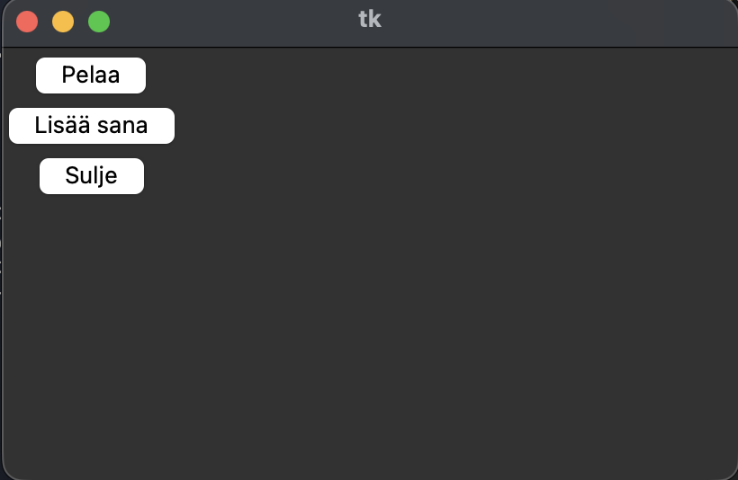

<h1 align="center">
  👾A language learning Game🕹
</h1>

 Try it out by cloning this repo and run main.py from your local machine! 

<h2> Demo pictures: </h2>

  

## Setting Up 
You will have to set up **Conda, and Python3**.
* To install dependencies: `pip install -r requirements.txt`
* To launch the game: `python3 main.py` 
